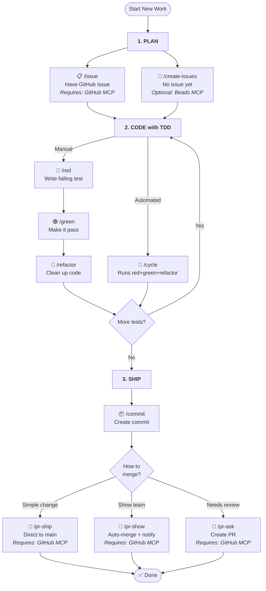

# @wbern/agent-instructions

[](https://www.npmjs.com/package/@wbern/agent-instructions)
[](https://www.npmjs.com/package/@wbern/agent-instructions)
[](https://github.com/wbern/agent-instructions/actions/workflows/release.yml)
[](https://codecov.io/gh/wbern/agent-instructions)
[](https://opensource.org/licenses/MIT)

[](https://claude.ai/code)
[](https://github.com/wbern/agent-instructions/graphs/contributors)
[](https://github.com/wbern/agent-instructions/pulls)
<!-- docs COMMANDS_BADGE -->
<!-- /docs -->

[](https://docs.anthropic.com/en/docs/claude-code/slash-commands)
[](https://opencode.ai/docs/commands/)
[](https://github.com/openai/codex)

**TDD workflow commands for AI coding agents (Claude Code, OpenCode, Codex).**

> "TDD helps you to pay attention to the right issues at the right time so you can make your designs cleaner, you can refine your designs as you learn." — Kent Beck

AI coding agents like [Claude Code](https://docs.anthropic.com/en/docs/claude-code/slash-commands), [OpenCode](https://opencode.ai/docs/commands/), and [Codex](https://developers.openai.com/codex/skills) can be extended with project- or user-level instruction files. Claude Code and OpenCode expose them as **slash commands** (`/foo` → contents of `foo.md`). Codex exposes them as **skills** (`$foo` to mention, or `/skills` to list — Codex does not support user-defined `/foo` slash commands). This repo provides ready-made content for Test-Driven Development workflows that installs into each agent's native mechanism.

Custom commands are just a glorified copy-paste mechanism—but that simplicity is what makes them effective for establishing consistent development practices.

Instead of explaining TDD principles each session, type `/red` to write a failing test, `/green` to make it pass, `/refactor` to clean up. The commands guide Claude through each step methodically—you focus on what to build, Claude handles the how.

Want to go faster? Use `/cycle` to let Claude run the entire red-green-refactor sequence before checking in with you. For even more autonomy (your mileage may vary), `/tdd` gives Claude full discretion on when to advance between phases.

Also included are commands for commits, PRs, code reviews, and other tasks that come up during day-to-day development.

## Installation

**One-off run (no install):**

```bash
npx @wbern/agent-instructions       # npm
pnpm dlx @wbern/agent-instructions  # pnpm
```

**Install globally:**

```bash
# Homebrew (tap once, then install)
brew tap wbern/tap
brew install wbern/tap/agent-instructions

# npm
npm install -g @wbern/agent-instructions
```

**Per-agent install examples:**

```bash
# Claude Code + OpenCode, project-scope slash commands
agent-instructions --scope=project --agent=both --overwrite

# Codex, user-scope skills
agent-instructions --scope=user --agent=codex --overwrite
```

The interactive installer lets you choose:

- **Feature flags**: Enable optional integrations like [Beads MCP](https://github.com/steveyegge/beads)
- **Scope**: User-level (global) or project-level installation
- **Agent**: `claude`, `opencode`, `codex`, or `both` (claude + opencode)

After installation, restart your agent if it's currently running.

### Codex: skills, not slash commands

Codex CLI does not support user-defined `/foo` slash commands. When you install with `--agent=codex`, this package writes [Codex skills](https://developers.openai.com/codex/skills) to `~/.codex/skills/<name>/SKILL.md` (user scope) or `.codex/skills/<name>/SKILL.md` (project scope). Invoke them by:

- Typing `$red`, `$green`, `$tdd`, etc. to mention a skill explicitly
- Running `/skills` to list installed skills
- Letting Codex pick implicitly — it can select a skill when your prompt matches its `description`

The `--agent=both` shortcut targets Claude Code + OpenCode only. To install for Codex, pass `--agent=codex` explicitly.

### Adding to Your Repository

To automatically regenerate commands when teammates install dependencies, add it as a dev dependency with a postinstall script:

```bash
npm install --save-dev @wbern/agent-instructions
```

Then add a postinstall script to your `package.json`:

```json
{
  "scripts": {
    "postinstall": "agent-instructions --scope=project --agent=both --overwrite"
  },
  "devDependencies": {
    "@wbern/agent-instructions": "^<!-- docs VERSION --><!-- /docs -->"
  }
}
```

This ensures commands are regenerated whenever anyone runs `npm install`, `pnpm install`, or `yarn install`.

**CLI Options:**

<!-- docs CLI_OPTIONS -->
<!-- /docs -->

## Customizing Commands

You can inject project-specific instructions into generated commands by adding a template block to your `AGENTS.md` or `CLAUDE.md` file.

Both `<claude-commands-template>` and `<agent-commands-template>` tags are supported — use whichever fits your project.

### Basic Usage

Add this to your project's `AGENTS.md` (or `CLAUDE.md`):

```markdown
# My Project

Other instructions here...

<agent-commands-template>
## Project-Specific Rules

- Always use pnpm instead of npm
- Run tests with `pnpm test`
</agent-commands-template>
```

When you run `agent-instructions`, the template content is appended to all generated commands.

### Targeting Specific Commands

Use the `commands` attribute to inject content only into specific commands:

```markdown
<agent-commands-template commands="commit,pr-ask">
## Git Conventions

- Use conventional commits format
- Reference issue numbers in commits
</agent-commands-template>
```

This injects the content only into `commit.md` and `pr-ask.md`.

### File Priority

The generator checks `CLAUDE.md` first, then `AGENTS.md`. Only the first file found is used.

## Which Command Should I Use?

### Main Workflow

This is the core TDD workflow. Additional utility commands (worktrees, spikes, etc.) are listed in [Available Commands](#available-commands) below.



## Available Commands

<!-- docs COMMANDS_LIST -->
<!-- /docs -->

## Getting Started

### Quick Start: Your First TDD Cycle

Here's a simple example to get you started with the TDD workflow:

**1. Write a failing test (`/red`)**

```
You: /red add a function that validates email addresses

Claude: I'll write a failing test for email validation.
[Creates test file with a test that checks email validation]
[Runs test - shows it failing because function doesn't exist yet]
```

**2. Make it pass (`/green`)**

```
You: /green

Claude: I'll implement the minimal code to pass the test.
[Creates the email validation function with basic implementation]
[Runs test - shows it passing]
```

**3. Refactor for quality (`/refactor`)**

```
You: /refactor extract regex pattern to a constant

Claude: I'll refactor while keeping tests green.
[Extracts magic values, improves code structure]
[Runs tests - confirms they still pass]
```

### Complete Workflow Example

**Starting from a GitHub issue:**

```
/issue 123
```

Claude analyzes the GitHub issue and creates a TDD implementation plan showing what tests to write.

**Running a full TDD cycle:**

```
/cycle implement user authentication with password hashing
```

Claude executes the complete red-green-refactor cycle: writes a failing test, implements it, then refactors.

**Individual phases for more control:**

```
/red test that users can't login with wrong password
/green
/refactor move password verification to separate function
```

**Committing and creating PRs:**

```
/commit
```

Claude reviews changes, drafts a commit message following project standards, and creates the commit.

```
/pr-ask
```

Claude analyzes commits, creates a PR with summary and test plan.

### What to Expect

- **`/red`** - Claude writes ONE failing test based on your description
- **`/green`** - Claude writes minimal implementation to pass the current failing test
- **`/refactor`** - Claude improves code structure without changing behavior
- **`/cycle`** - Claude runs all three phases in sequence for a complete feature

The commands enforce TDD discipline: you can't refactor with failing tests, can't write multiple tests at once, and implementation must match test requirements.

## Example Conversations

<!-- docs EXAMPLE_CONVERSATIONS -->
<!-- /docs -->

## Transparency: @wbern's Usage Stats (Apr 8 – May 15, 2026)

Counted across all Claude Code sessions, filtered to commands shipped by this repo. Total: 1,286 invocations over ~5 weeks. Movement shown vs. the Jan 20 – Feb 3, 2026 sample (previously mislabeled as 2025).

| Command | Usage | Movement |
|---------|-------|----------|
| /code-review | 27% | ▲ up from 13% |
| /tdd | 20% | ▼ down from 26% |
| /research | 18% | ▲ up from 15% |
| /commit | 15% | ▲ up from 8% |
| /gap | 12% | ▼ down from 15% |
| /polish | 4% | ▲ up from 2% |
| /red | 1% | ▼ down from 2% |
| /green | 1% | ▲ new (not in prior sample) |
| /summarize | <1% | ≈ flat (was 1%) |
| /refactor | <1% | ▼ down from 5% |

Other commands from the prior sample that fell out of regular use this window: `/create-issues` (was 4%), `/issue` (2%), `/worktree-add` (2%), `/pr` (1%), `/spike` (1%), `/tdd-review` (1%), `/create-adr` (1%).

The rest (`/kata`, `/busycommit`, `/beepboop`, `/simplify`, `/pr-show`, `/pr-ship`, `/pr-ask`, `/worktree-cleanup`, `/worktree-setup`, `/gastown-setup`, `/upgrade-deps`, `/commit-hook-checklist`, `/add-command`) didn't see use in this window — kept around because they earn their keep occasionally, even if not weekly.

## Contributing

See [CONTRIBUTING.md](CONTRIBUTING.md) for development workflow, build system, and fragment management.

## Credits

TDD workflow instructions adapted from [TDD Guard](https://github.com/nizos/tdd-guard) by Nizar.

FIRST principles and test quality criteria from [TDD Manifesto](https://tddmanifesto.com/).

Example kata from [Cyber-Dojo](https://cyber-dojo.org/).

## Related Projects

- [citypaul/.dotfiles](https://github.com/citypaul/.dotfiles) - Claude Code configuration with TDD workflows and custom commands
- [nizos/tdd-guard](https://github.com/nizos/tdd-guard) - Original TDD Guard instructions for Claude
